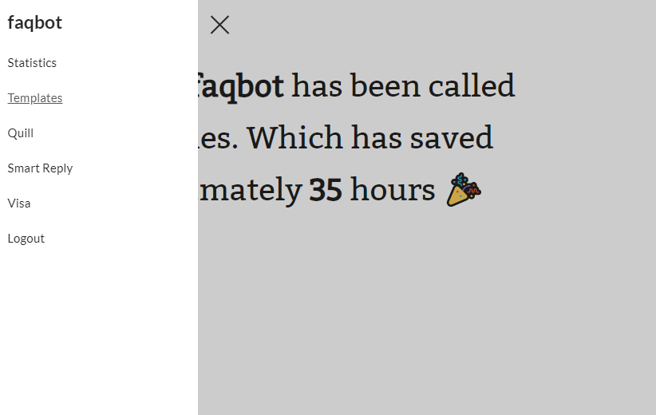

# faqbot

A bot to manage emails that ask frequenty asked questions.



## Features

### Canned Replies

Super simple interface to reply to an email with a canned response. Simply reply to faqbot with `@faqbot <template_name>` and faqbot will respond to the original email with the response.

### Hackable Email Modules

Easy API to add new email bot features. Simply hook into a `email_callback` and use the API to do tasks and reply to emails that suit your needs.

### Smart Reply

With a lot of faqbot usage from your organization, you can train a model such that faqbot can figure out how to reply on its own.

### Quill Integration

If you run a hackathon and use HackMIT's quill registration system, faqbot comes pre-baked with quill integration. Whitelist email addresses right from your inbox.

#### And many more!

## Setup

Use Python 2.7,

Resolve dependencies,

```bash
pip install -r requirements.txt
```

You need to place the `config.py` file inside the `faqbot` directory. We have provided an example config in the `faqbot` directory, [config.example.py](faqbot/config.example.py).

### Running

To run for local debugging,

```bash
python app.py
```

To run on production,

```bash
python run.py
```

## Usage

### Control Panel

Head over to the url where you've deployed faqbot to view the control panel. There you can enable / disable features, tweak settings and add new templates.

### Basic Usage

Reply all to the email thread without the person who sent the email. Or reply-one to `admin@hackmit.org` (or your configured mail-box) with the body text:

```
@faqbot latereg
```

This will reply to the person a generic response to "I didn't register for you hackathon before the deadline."

You can also use the `@fb` trigger for shorthand.

### Quill

faqbot has a quill integration module (HackMIT's registration system). This is used to whitelist emails in our system.

```
@faqbot whitelist <email>
```

This will whitelist the given email in quill and reply to the person.

### Smart Reply

faqbot can learn emails > template mapping and will attempt to automatically reply to an email if it's confident enough.

To use Smart Reply on your own emails, collect training data,

```
python tasks.py --collect
```

and then train the model on the collected dataset,

```
python tasks.py --train
```


## Development

### Writing Code

faqbot's codebase is designed to be hackable. The main directory to add a new feature is the `faqbot/features/` directory. Here you can register for email callbacks and use the faqbot API to send reply-all or reply-one messages based on the email you just received.

Adding new features is extensively documented in the [`features` module](faqbot/features/__init__.py). You can also take a look at the [quill feature](faqbot/features/quill.py) as an example feature to off of.

### Testing

The tests right now are hidden, because they are based on emails we've received in the past and hence reveal private information. However, I do plan on anonmyzing them and checking them in here. In any case, the tests are run as follows:

```
python -m unittest tests.test_parsing
```

### Contributing

Try to use [black](https://github.com/ambv/black) and follow that style for everything oustide of `legacy/`. Contribute by opening pull requests and report bugs by creating issues. Email parsing in general is nasty so opening bugs for parsing errors will be really helpful.

## License
Copyright (c) 2018-2019 Shreyas Kapur. Released under AGPLv3. See [LICENSE.md](LICENSE.md) for details.
